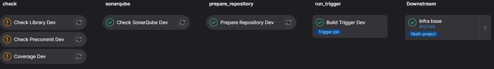
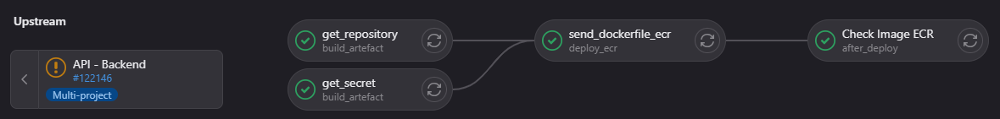
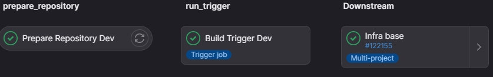
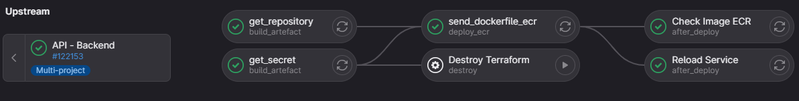
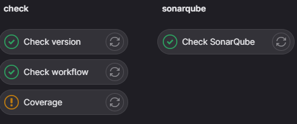
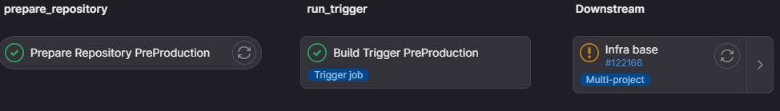
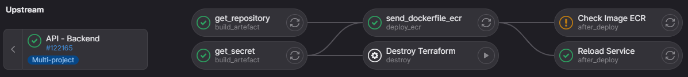
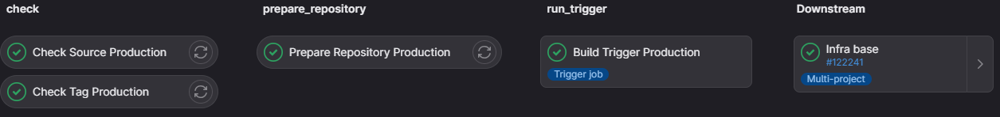
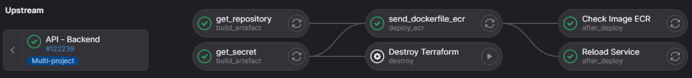

[[_TOC_]]

# The git workflow

## Create your branch
**The branch default of the project is `dev`.**

Then for a new feature, start by creating a branch from the branch dev by the following comand :
`git checkout -b NEW_BRANCH`
## Create a merge request from your branch to the branch dev
After pushing your branch, you have to create a merge request in gitlab to the branch dev.

This merge request will trigger a pipeline with the following jobs :
- `Check Library Dev`.
- `Check Precommit Dev`.
- `Coverage Dev`.
- `Check SonarQube Dev`.
- `Prepare Repository Dev`.
- `Build Trigger Dev` : trigger the project terraform with the following jobs :
    - `get_repository`.
    - `get_secret`.
    - `send_dockerfile_ecr`.
    - `Check Image ECR`.

## Validate the merge request to dev
When you validate the merge request to dev, you update the environment dev by running the following jobs :
- `Prepare Repository Dev`.
- `Build Trigger Dev` : trigger the project terraform with the following jobs :
    - `get_repository`.
    - `get_secret`.
    - `send_dockerfile_ecr`.
    - `Check Image ECR`.
    - `Reload Service`.

## Create a merge request from branch dev to the branch master
Now your dev environment is stable and ready, you want to run your work in preproduction environment. To do that, create a merge request in gitlab from the dev branch to the master branch.

This merge request will trigger a pipeline with the following jobs :
- `Coverage`.
- `Check version`.
- `Check workflow`.
- `Check SonarQube`.

## Validate the merge request to master
When you validate the merge request to master, you update the environment preproduction by running the following jobs :
- `Prepare Repository PreProduction`.
- `Build Trigger PreProduction` : trigger the project terraform with the following jobs :
    - `get_repository`.
    - `get_secret`.
    - `send_dockerfile_ecr`.
    - `Check Image ECR`.
    - `Reload Service`.

## Update the production environment
Finally, you want to have the new version of the API in the production environment. To do that, create a tag from the branch master. The name of the tag should be like `vX.Y.Z` where `X.Y.Z` is the version of the API. Create this tag will trigger a pipeline with the following jobs :
- `Check Source Production`.
- `Check Tag Production`.
- `Prepare Repository Production`.
- `Build Trigger Production` : trigger the project terraform with the following jobs :
    - `get_repository`.
    - `get_secret`.
    - `send_dockerfile_ecr`.
    - `Check Image ECR`.
    - `Reload Service`.

## Description of environments

|branch or tag|name|environment|information|
|---|---|---|---|
|branch|dev|dev|The default branch.|
|branch|master|preproduction|Corresponding to the environment **ppd** in AWS.|
|tag|vX.Y.Z|production|Corresponding to the environment **prd** in AWS. The tag is the version of the API.|

## Description of jobs

|name|step|description|
|---|---|---|
|Check Library|merge request to dev|Check outdated libraries *(doesn't work for now because waiting for a python runner)*.|
|Check Precommit|merge request to dev|Check if pre-commit succeed *(doesn't work for now because waiting for a python runner)*.|
|Coverage|merge request to dev or master|Run pytest and save the coverage *(doesn't work for now because waiting for a python runner)*.|
|Check SonarQube|merge request to dev or master|Run sonarqube.|
|Check version|merge request to master|Check if the version is changed.|
|Check workflow|merge request ro master|Check the source branch of the merge request is the branch allowed (source branch have to be dev for a merge request to master).|
|Check Source|tag vX.Y.Z from master|Check if the last commit is in branch master.|
|Check Tag|tag vX.Y.Z from master|Check if the tag is `vX.Y.Z`.|
|Prepare Repository|merge request to dev or master, branch dev or master, tag vX.Y.Z from master|Zip the project for the next job.|
|Build Trigger|merge request to dev or master, branch dev or master, tag vX.Y.Z from master|Trigger the project terraform and run the next jobs.|
|get_repository|merge request to dev or master, branch dev or master, tag vX.Y.Z from master|Get the project by the zip created in the job `Prepare Repository`.|
|get_secret|merge request to dev or master, branch dev or master, tag vX.Y.Z from master|Get the aws credentials.|
|send_dockerfile_ecr|merge request to dev or master, branch dev or master, tag vX.Y.Z from master|Send the image of the project to the ECR.|
|Check Image ECR|merge request to dev or master, branch dev or master, tag vX.Y.Z from master|Check if the sent image in the ECR have some vulnerabilities.|
|Reload Service|merge request to master, branch dev or master, tag vX.Y.Z from master|Run terraform for ecs_backend, that reload the API service.|
